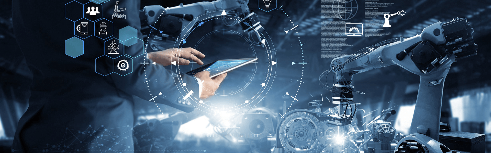

<!-- TITLE -->

  

<h1 align="center">Hi 👋, I'm Fadi Helal</h1>
<h3 align="center">Robotics & AI Engineer | Game Developer | IoT Innovator</h3>

  

<!-- BADGES -->

  
  
  

---

### 🧠 Who Am I?

> ⚙️ A Robotics Software Engineer with deep expertise in AI/ML, Reinforcement Learning, and intelligent systems.  
> 🎮 Passionate about immersive game development and real-world robotics integration.  
> 🌍 Innovating at the intersection of software, hardware, and AI for smarter systems.

---

### 💼 What I Do

- 🤖 Build autonomous robotics platforms with **ROS**, **RL**, and **Sensor Fusion**
- 🧠 Research and implement **Deep Reinforcement Learning** algorithms
- 🌐 Develop smart IoT systems using **Python**, **C++**, **Raspberry Pi**, and **Arduino**
- 🎮 Create game simulations and gamified AI environments in **Unity** and **Unreal Engine**
- 🚀 Mentor aspiring engineers and share knowledge through open source

---

### 🛠️ Tech Stack

| Area            | Tools & Frameworks |
|------------------|---------------------|
| **AI/ML**        | PyTorch, TensorFlow, Scikit-Learn |
| **Reinforcement Learning** | Gym, SB3, PPO, SAC, Q Learn and many more|
| **Robotics**     | ROS, Gazebo, Lidar, Path Planning |
| **Game Dev**     | Unity, C#, Unreal Engine |
| **IoT**          | Arduino, ESP32, MQTT |
| **Dev Tools**    | Git, Docker, CI/CD, VSCode |
| **Languages**    | Python, C++, C#, Bash |

---

### 🌟 Featured Projects

<table>
  <tr>
    <td>
      
       
      <b>Autonomous Mobile Robot</b> 
      Built an RL-based robot that dynamically avoids obstacles and reaches targets in cluttered maps using PPO in ROS.
    </td>
    <td>
      
       
      <b>AI Game Simulation</b> 
      Developed interactive training simulations to evolve AI agents in game-style environments (Unity ML-Agents).
    </td>
  </tr>
</table>

> 🔗 View More on: [My GitHub Repos »](https://github.com/Elythaq?tab=repositories)

---

### 📈 My GitHub Stats

  
   
  
   
  

---

### 📣 Let’s Collaborate

🚀 I'm open to:
- Robotics or AI projects
- Game development collaborations
- Speaking or mentoring opportunities

📬 Reach out via [LinkedIn](https://linkedin.com/in/fadi-helal) or drop a message on any platform linked above.

---

### 🔥 Fun Fact

> I treat AI and Robotics like art — merging creativity, logic, and strategy to build systems that *feel alive*.

---

